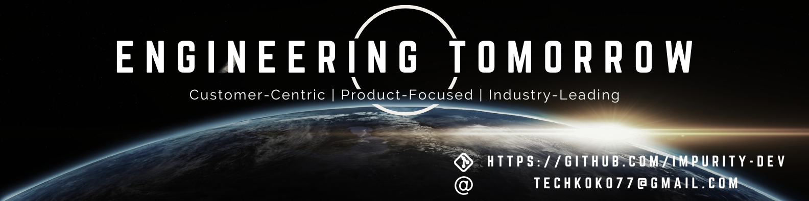

    

# Hi, I'm Tyler! 👾

I am a solutions software engineer from Boston, MA with a masters of computer science, specializing in interactive intelligence. I seek to utilize artificial intelligence, machine learning, and cloud-based technologies to maximize effectiveness of applications through personalization and analytics.

## Technologies 💻

## What am I working on? 🌌

📚 Learning AI, ML, and DL techniques to develop myself as a industry leader as we dive deeper into the singularity    
📝 Creating myself a personal website [Personal Website](https://impurity-dev.github.io/professional-website/) using BabylonJS, Typescript, and Webpack    
🛠 Working full time as a Solutions Engineer    

    

